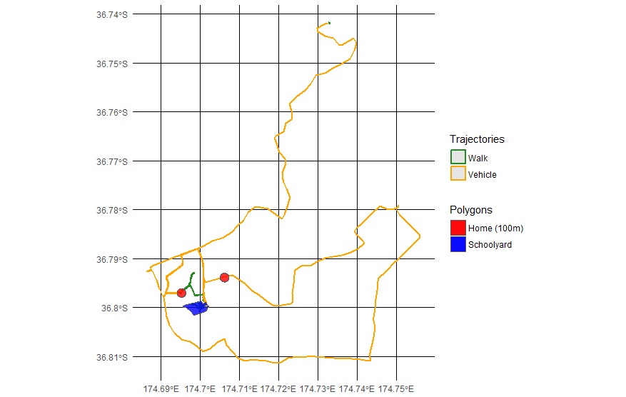

<!-- README.md is generated from README.Rmd. Please edit that file -->
PALMSplus for R
===============

<!--[](https://ci.appveyor.com/project/TheTS/palmsplusr)-->
<!--[](https://travis-ci.org/TheTS/palmsplusr) -->
<!--[](https://codecov.io/gh/TheTS/actigraph.sleepr)-->
[](http://www.repostatus.org/#active) [](commits/master) [](/commits/master)

Overview
--------

**palmsplusr** is an extension to the *Personal Activity Location Measurement System* ([PALMS](https://ucsd-palms-project.wikispaces.com/)). This package provides a customisable platform to combine PALMS data with other sources of information (e.g., shapefiles or csv files). This enables physical activity researchers to answer higher-level questions, such as:

-   How much time is spent in parks?
-   How much MVPA is accumulated in parks?
-   What proportion of sedentary time is accumulated during vehicular travel?
-   What is the average distance of home-to-school trips?
-   How much MVPA is accumulated inside the schoolyard during school time?
-   What proportion of commuters trip chain different travel modes (e.g., walk-bus-walk)
-   What is the average speed of bicycle trips during peak travel times?
-   etc.

The PALMS data are combined with other input files to build the palmsplus [simple features](https://github.com/r-spatial/sf) data frame. Once palmsplus is built, it can be summarised two ways:

-   `days` provides a breakdown of information per day, per person (e.g., time spent in greenspace)
-   `trajectories` builds individual trips, and provides trip-level summaries (e.g., MVPA during the work commute). This can then be processed into multimodal trips if desired.

The user is able to specify how each data source is combined. This is done by creating `field` tables using highly customisable formulas.


Brief Example
-------------

This example demonstrates the most basic implementation with one participant:

``` r
library(palmsplusr)

palms <- read_palms("D:/data/csv/one_participant.csv")

palms_load_defaults(palms_epoch(palms))
```

The `palms_load_defaults()` function automatically populates the field tables with basic formulas. Each of these fields will be calculated and added to the `palmsplus` dataset. The default `palmsplus_fields` table looks like:

``` r
palmsplus_fields
#> # A tibble: 16 x 3
#>    name       formula                domain_field
#>    <chr>      <chr>                  <chr>       
#>  1 weekday    dow < 6                FALSE       
#>  2 weekend    dow > 5                FALSE       
#>  3 indoors    iov == 3               FALSE       
#>  4 outdoors   iov == 1               FALSE       
#>  5 in_vehicle iov == 2               FALSE       
#>  6 inserted   fixtypecode == 6       FALSE       
#>  7 pedestrian tripmot == 1           FALSE       
#>  8 bicycle    tripmot == 2           FALSE       
#>  9 vehicle    tripmot == 3           FALSE       
#> 10 nonwear    activityintensity < 0  TRUE        
#> 11 wear       activityintensity >= 0 TRUE        
#> 12 sedentary  activityintensity == 0 TRUE        
#> 13 light      activityintensity == 1 TRUE        
#> 14 moderate   activityintensity == 2 TRUE        
#> 15 vigorous   activityintensity == 3 TRUE        
#> 16 mvpa       moderate + vigorous    TRUE
```

In addition to `palmsplus_fields`, there are three other field tables \* `palmsplus_domains` is used to specify aggregation domains for `days` \* `trajectory_fields` is used to specify fields for `trajectories` \* `trajectory_locations` is used to specify trip start and end locations (e.g., home-school) \* `multimodal_fields` is used to specify the fields sumarized in `multimodal`

Any user-created fields can be appended to these tables. Building datasets using these field tables is as simple as:

``` r
# Building palmsplus
palmsplus <- palms_build_palmsplus(palms)
#> [1/1] Computed palmsplus for: BC0627

# Building days
days <- palms_build_days(palmsplus)

# Building trajectories
trajectories <- palms_build_trajectories(palmsplus)

# Building multimodal trajectories
multimodal <- palms_build_multimodal(trajectories, 200, 10)
#> Calculating multimodal eligibility...done
#> Assigning trip numbers...done
#> Calculating fields...done
```

Results can easily be saved to csv or shapefile:

``` r
write_csv(days, "days.csv")
st_write(trajectories, "trajecories.shp")
```

Plotting
--------



Installation
------------

The easiest way to install **palmsplusr** is using devtools:

``` r
library("devtools")
install_github("TheTS/palmsplusr")
```

Documentation and Examples
--------------------------

For further information and examples, please see the [GitHub documentation](http://thets.github.io/palmsplusr/)

### Notes

This project is based on the [palmsplus](https://github.com/bsnizek/palmsplus) project originally written in PostgreSQL and PostGIS by [Bernhard Snizek](http://www.snizek.com).
